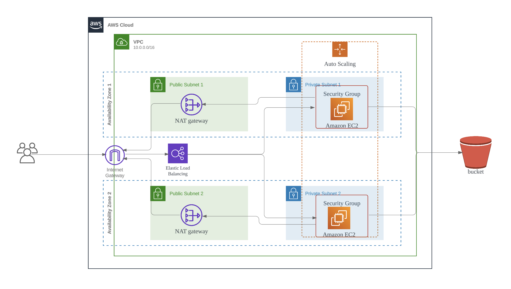
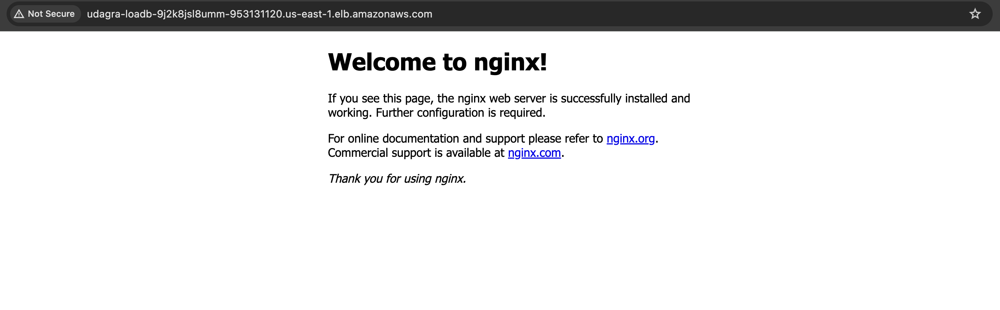
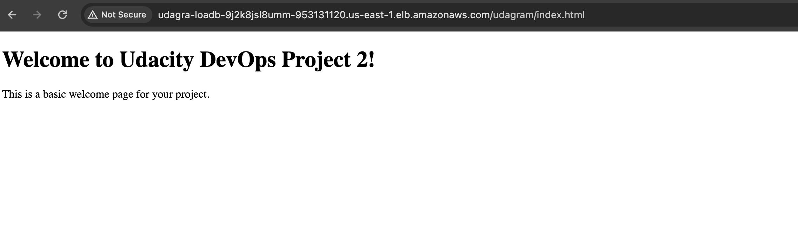

# ND9991 - Course 2 - Infrastructure as Code

This repository contains the starter code for the final project of course 2 Infrastructure as Code in the Cloud DevOps Engineer Nanodegree.

Please note that all supporting material for this course can be found in [this Github repository](https://github.com/udacity/cd12352-Deploy-Infrastructure-as-Code).

# Deploy a high-availability web app using CloudFormation

In this project, you’ll deploy web servers for a highly available web app using CloudFormation. You will write the code that creates and deploys the infrastructure and application for an Instagram-like app from the ground up. You will begin with deploying the networking components, followed by servers, security roles and software.  The procedure you follow here will become part of your portfolio of cloud projects. You’ll do it exactly as it’s done on the job - following best practices and scripting as much as possible. 

# Diagram



# Evidence

http://udagra-loadb-9j2k8jsl8umm-953131120.us-east-1.elb.amazonaws.com/


http://udagra-loadb-9j2k8jsl8umm-953131120.us-east-1.elb.amazonaws.com/udagram/


# How to build

## Creating the network

Execute the following command to create a network resource(VPC, Subnet, NAT Gateway...).

```
./scripts/create.sh udagram-p2-network ./starter/network.yml ./starter/network-parameters.json 
```

## Creating the app

Execute the following command to create a app in server(EC2, Auto scaling, Load balancer...).

```
./scripts/create.sh udagram-p2-app  ./starter/udagram.yml ./starter/udagram-parameters.json
```

## Update, Delete stacks

```
./scripts/update.sh udagram-p2-network ./starter/network.yml ./starter/network-parameters.json 
./scripts/delete.sh udagram-p2-network 
```